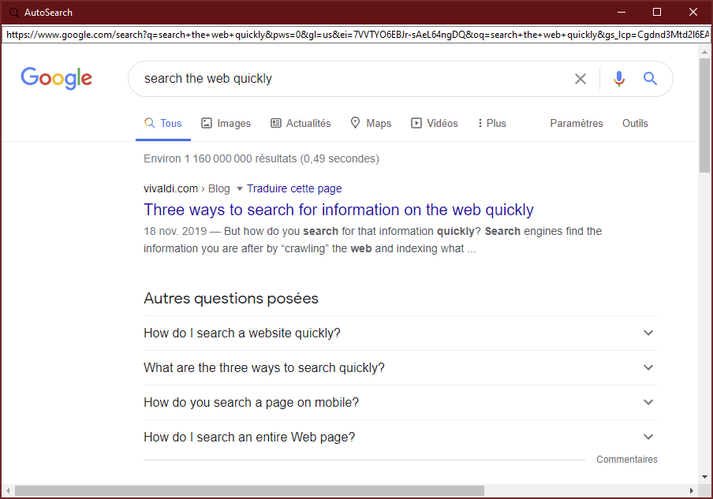

# Auto-Search
A tiny Web browser that automatically searches Google for the contents of your clipboard. Handy for quickly looking up a word you just copied from any application.

<b>Features:</b>
- tiny (main executable is just 2MB);
- multi-platform (Windows, MacOSX, Linux);
- loads instantly;
- uses whichever default browser engine your OS uses;
- no JavaScript;
- no flash player;
- Google's localization is automatically disabled (Google U.S. results).

# Downloads

You can <b>download</b> the latest release for <b>Windows</b> [HERE](https://github.com/DexterLagan/auto-search/releases/tag/v1.0).

# Build Instructions
The app is made with Xojo 2019r3.1. Simply download the project file and icon, then build a standalone executable for any platform.

## License

Auto-Search is free software; see [LICENSE](https://github.com/DexterLagan/auto-search/blob/main/LICENSE) for more details.
